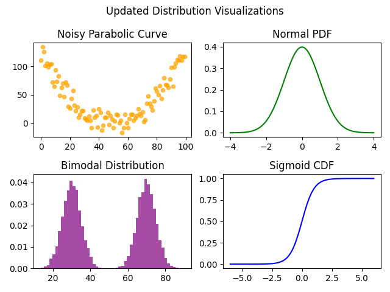

# Distribution Visualizer CLI

This project visualizes various statistical patterns using Python, focusing on diversity in shapes and types of distributions. It uses `matplotlib` and `numpy` to generate custom charts that are educational, flexible, and safe to share.

## 📊 Visualizations Included
The CLI script displays four types of statistical plots:

1. **Noisy Parabolic Curve**
   - Synthetic nonlinear data with added noise, useful for demonstrating curved regression patterns.

2. **Normal Distribution PDF**
   - A bell-shaped probability density function for standard normal distribution.

3. **Bimodal Histogram**
   - Displays two overlapping normal distributions to simulate dual peaks — often used to represent data with two distinct groups.

4. **Sigmoid Cumulative Distribution (CDF)**
   - S-curve generated using the logistic function to simulate cumulative probability transitions.

## 🛠️ Skills Demonstrated
- Custom data generation
- Curve fitting and trend exploration
- Bimodal simulation
- Visualization styling and labeling
- Matplotlib plotting and subplot layout

## 🚀 How to Run
### Requirements
- Python 3.x
- `matplotlib`
- `numpy`

### Run the Script
```bash
python distribution_visualizer.py
```

## 📷 Output Preview


## 🔮 Future Extensions
- Allow user selection of specific plots
- Enable export to PNG/PDF
- CLI options for plot styles, sizes, or output path

## 👩‍💻 Author
Nasim Bayati

---
This tool was independently developed as an educational project and does not include any proprietary or institutional assignment material.
